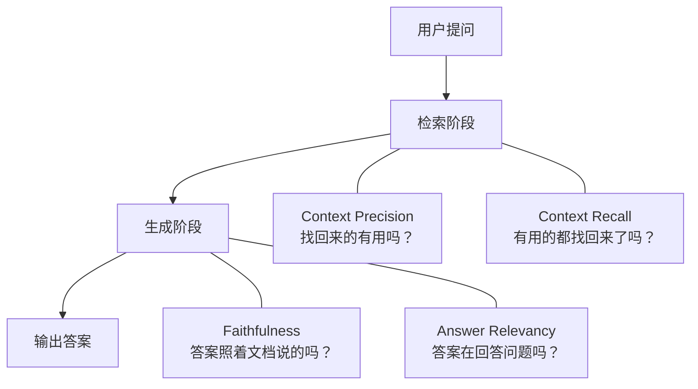

RAGAS 是目前使用最广泛的 RAG 评测框架，核心思路是用 LLM 作为裁判自动对 RAG 系统的检索和生成质量打分，无需人工标注评测集。评测时只需提供四类数据：用户问题（`question`）、系统生成的答案（`answer`）、检索到的文档片段（`contexts`）、以及标准答案（`ground_truth`，部分指标需要）。

| 字段 | 含义 | 示例 |
|------|------|------|
| `question` | 用户提问 | "巴黎有多少人口？" |
| `answer` | RAG 系统生成的回答 | "巴黎人口约 216 万" |
| `contexts` | 检索到的文档片段 | ["巴黎是法国首都，2024年人口约216万"] |
| `ground_truth` | 标准答案 | "巴黎人口约216万（2024年数据）" |

以下从安装、首次运行、四个核心指标的逐项拆解、指标组合诊断、到常见实践问题，覆盖评测接入的全流程。

## 一、快速上手

### 1.1 安装

```bash
pip install ragas
```

依赖 OpenAI API key（RAGAS 默认用 GPT-4o-mini 作为裁判模型）：

```bash
export OPENAI_API_KEY="sk-xxxxxxxx"
```

如需使用其他 LLM 提供商，参见 4.1 节关于裁判模型切换的说明。

### 1.2 首次运行

```python
from ragas import evaluate
from ragas.metrics import faithfulness, answer_relevancy, context_precision, context_recall
from datasets import Dataset

# 1. 准备评测数据
data = {
    "question": [
        "法国首都是哪里？",
        "巴黎有多少人口？",
    ],
    "answer": [
        "巴黎是法国的首都，位于塞纳河畔",
        "巴黎有大约216万人口",
    ],
    "contexts": [
        ["巴黎是法国的首都和最大城市", "法国以葡萄酒文化著称"],
        ["2024年巴黎市区人口约为216万人", "巴黎面积105平方公里"],
    ],
    "ground_truth": [
        "巴黎是法国首都",
        "巴黎人口约216万（2024年）",
    ],
}

# 2. 转换为 RAGAS 格式
dataset = Dataset.from_dict(data)

# 3. 执行评测
result = evaluate(
    dataset,
    metrics=[faithfulness, answer_relevancy, context_precision, context_recall],
)

# 4. 查看结果
print(result)
```

输出：

```
{'faithfulness': 0.8333, 'answer_relevancy': 0.7856, 'context_precision': 0.6667, 'context_recall': 0.7500}
```

一次运行拿到四个维度的量化分数。

## 二、四个指标：一个例子拆到底

以下用一个完整示例贯穿四个指标的解释。

**场景设定：**

```
用户问题（question）:      "法国首都在哪里？有什么特点？"
标准答案（ground_truth）:  "法国首都是巴黎，位于塞纳河畔，以埃菲尔铁塔和卢浮宫闻名"

RAG 系统检索到的文档（contexts，检索器按相关度返回 top-k=5，位置越靠前相关度越高）:
  位置1 [文档1] "巴黎是法国的首都，也是法国最大的城市"
  位置2 [文档2] "法国以葡萄酒文化和美食闻名于世"
  位置3 [文档3] "里昂是法国重要的工业城市"
  位置4 [文档4] "巴黎的行政区划分为20个区"
  位置5 [文档5] "巴黎拥有众多世界知名的博物馆与艺术馆"

RAG 系统生成的答案（answer）:
  "法国首都是巴黎。它位于塞纳河畔，以埃菲尔铁塔而闻名。《蒙娜丽莎》就在卢浮宫里。"
```

答案中包含四类信息："巴黎是首都"（文档1 中有依据）、"塞纳河畔"（答案提了但文档中没有）、"埃菲尔铁塔"（同样没有依据）、"《蒙娜丽莎》在卢浮宫"（也没有依据）。后三类就是幻觉。

### 2.1 Faithfulness（忠实度）——答案是照着文档说的，还是自己编的？

**衡量维度**：答案中的每句话，能否从检索到的文档中找到依据。

**计算过程**：

```
Step 1: RAGAS 将答案拆解为独立声明（claims）
  答案 →
    声明1: "法国首都是巴黎"
    声明2: "巴黎位于塞纳河畔"
    声明3: "巴黎以埃菲尔铁塔闻名"
    声明4: "《蒙娜丽莎》在卢浮宫"

Step 2: 逐条验证——该声明在检索文档中是否可找到？
    声明1: 文档1 含"巴黎是法国的首都" → YES ✓
    声明2: 检索到的全部文档均未提及"塞纳河" → NO ✗（幻觉）
    声明3: 检索到的全部文档均未提及"埃菲尔铁塔" → NO ✗（幻觉）
    声明4: 检索到的全部文档均未提及"蒙娜丽莎"或"卢浮宫" → NO ✗（幻觉）

Step 3: Faithfulness = 被支持的声明数 / 总声明数 = 1/4 = 0.25
```

Faithfulness = 0.25 意味着答案中 75% 的内容无法从检索文档中得到支撑。即便这些内容客观上正确（埃菲尔铁塔确实在巴黎），从评测角度看，RAG 系统不应当输出未被检索文档支撑的信息。

**参考阈值**：一般应用建议 > 0.85，高风险领域（法律、医疗）> 0.95。

### 2.2 Answer Relevancy（答案相关性）——回答的是用户真正在问的吗？

**衡量维度**：答案内容是否与用户提问相关，是否存在跑题。

**计算过程**：

```
Step 1: RAGAS 让 LLM 根据答案反向生成问题
  答案: "法国首都是巴黎。它位于塞纳河畔，以埃菲尔铁塔而闻名..."
  → LLM 可能生成:
    问1: "法国的首都在哪里？"        → 与原始问题高度相关
    问2: "巴黎有什么名胜古迹？"      → 部分相关但已偏离
    问3: "法国菜有什么特色？"        → 不相关

Step 2: 计算生成问题与原始问题的语义相似度
    原始问题 embedding ←→ 问1 embedding: 余弦相似度 0.92
    原始问题 embedding ←→ 问2 embedding: 余弦相似度 0.45
    原始问题 embedding ←→ 问3 embedding: 余弦相似度 0.08

Step 3: Answer Relevancy = (0.92 + 0.45 + 0.08) / 3 = 0.48
```

Answer Relevancy = 0.48 说明答案约一半内容与用户提问无关——虽然开头正确回答了"首都是巴黎"，但后续内容偏离了问题。

**注意**：Answer Relevancy 高不等于答案正确。Faithfulness = 0.1 但 Relevancy = 0.9 的系统意味着：问题理解对了，但答案全在编造。反之，Faithfulness = 0.95 但 Relevancy = 0.3 意味着：内容都来自文档，但与问题无关。

**参考阈值**：> 0.80。

### 2.3 Context Precision（上下文精确率）——检索回来的文档有多少是真正有用的？

**衡量维度**：检索器返回的文档中，与问题相关的比例，以及相关文档是否排在靠前位置。

以下沿用"场景设定"中检索器返回的 top-k=5 结果（已按相关度排序），计算其加权精确率：

**计算过程**：

```
检索器返回 5 条文档（top-k=5，按场景设定中的排序）：

  位置1 [文档1] "巴黎是法国的首都，也是法国最大的城市"   → 相关 ✓
  位置2 [文档2] "法国以葡萄酒文化和美食闻名于世"         → 无关 ✗
  位置3 [文档3] "里昂是法国重要的工业城市"               → 无关 ✗
  位置4 [文档4] "巴黎的行政区划分为20个区"               → 相关 ✓
  位置5 [文档5] "巴黎拥有众多世界知名的博物馆与艺术馆"     → 相关 ✓

加权精确率（靠前位置权重更高）：

  位置1: 权重 1.00 × 相关(1) = 1.00
  位置2: 权重 0.50 × 无关(0) = 0
  位置3: 权重 0.33 × 无关(0) = 0
  位置4: 权重 0.25 × 相关(1) = 0.25
  位置5: 权重 0.20 × 相关(1) = 0.20

  加权总和: 1.00 + 0 + 0 + 0.25 + 0.20 = 1.45
  相关文档总数: 3

  Context Precision = 1.45 / 3 = 0.48
```

Context Precision = 0.48 说明检索器找到了 3 条相关文档（文档1、文档4、文档5），但它们分散在第 1、4、5 位，中间夹杂的无关内容（文档2、文档3）可能干扰 LLM 生成质量。

**参考阈值**：> 0.70。

### 2.4 Context Recall（上下文召回率）——回答需要的信息都捞到了吗？

**衡量维度**：完整回答用户问题所需的信息，检索器覆盖了多少。

**计算过程**：

```
Step 1: 将标准答案拆解为必要信息单元
  Ground truth: "法国首都是巴黎，位于塞纳河畔，以埃菲尔铁塔和卢浮宫闻名"
  → 拆解为:
    必须信息1: 法国首都是巴黎
    必须信息2: 巴黎位于塞纳河畔
    必须信息3: 以埃菲尔铁塔闻名
    必须信息4: 以卢浮宫闻名

Step 2: 逐条检查检索文档中是否包含

  必须信息1 "首都是巴黎": 文档1 含 → 找到 ✓
  必须信息2 "塞纳河畔":   检索到的文档中均无 → 未找到 ✗
  必须信息3 "埃菲尔铁塔":  检索到的文档中均无 → 未找到 ✗
  必须信息4 "卢浮宫":     检索到的文档中均无 → 未找到 ✗

Step 3: Context Recall = 1/4 = 0.25
```

Context Recall = 0.25 意味着回答该问题所需的 4 条关键信息中，3 条根本没有被检索到。无论 LLM 能力多强，未被检索到的信息不可能出现在答案中。

**参考阈值**：> 0.80。低于 0.70 时应优先修复检索侧：增大 top-k、升级 embedding 模型、引入混合检索（dense + BM25）、或调整 chunking 策略。

## 三、指标组合诊断

四个指标不是平行关系。检索和生成是串联的两个阶段，排查问题的正确顺序是**先检索维度、再生成维度**。



### 3.1 组件-指标映射

每个指标的波动由系统的特定组件驱动。修改某组件后，优先关注对应的指标：

| 改动的组件 | 重点关注的指标 |
|-----------|-------------|
| chunking 策略 | Context Recall（chunk 过大会遗漏关键句） |
| embedding 模型 | Context Precision（embedding 质量直接影响排序） |
| top-k / 检索数量 | Context Recall + Context Precision（二者为跷跷板关系） |
| system prompt | Faithfulness（prompt 决定 LLM 是否忠实引用文档） |
| LLM 模型 | 全部四个指标，Faithfulness 和 Relevancy 最敏感 |

### 3.2 分数组合诊断

单个指标分数本身意义有限，正确的方式是看分数的组合模式：

| 分数模式 | 诊断结论 | 修复方向 |
|---------|---------|---------|
| 四项均在 0.8 以上 | 系统基本健康 | 重点关注 Recall，它通常是第一个下降的 |
| Recall 低 + Precision 高 | 检索到的少但准确，信息遗漏严重 | 增大 top-k，或尝试混合检索 |
| Recall 高 + Precision 低 | 信息都在但被噪音淹没 | 引入 re-ranker |
| Faithfulness 低 + Relevancy 高 | LLM 理解了问题但在编造内容 | 收紧 system prompt，降低 temperature |
| Faithfulness 高 + Relevancy 低 | 没编内容但也没回答对的问题 | 检索侧出问题，查 Precision 和 Recall |
| Faithfulness 低 + 答案碰巧对 | 危险信号：LLM 在用自身知识回答，绕过了检索系统 | 检查 prompt 是否强制要求引用文档 |

### 3.3 ragas_score

RAGAS 还提供一个综合分 `ragas_score`，取四个指标的调和平均值。调和平均对低分敏感——只要有一个指标明显偏低，综合分就会被拉低。适合作为 CI/CD 门禁的快速健康检查（如 `ragas_score > 0.75`），但不应替代四个指标的独立分析。

## 四、实践注意事项

### 4.1 裁判模型与生成模型分离

RAGAS 默认使用 OpenAI 模型作为裁判。如果 RAG 系统的生成模型也来自 OpenAI，则形成了"同一个模型给自己打分"的循环评测，分数会系统性偏高。

解决方案是使用不同提供商、不同模型家族的 LLM 作为裁判。RAGAS 通过 `llm_factory` 支持任意具备 OpenAI 兼容 API 的 LLM：

```python
from openai import OpenAI
from ragas.llms import llm_factory

# 适用于任何具有 OpenAI 兼容 API 的 LLM
client = OpenAI(
    api_key="your-api-key",
    base_url="https://your-api-endpoint"
)
judge_llm = llm_factory("model-name", provider="openai", client=client)

result = evaluate(
    dataset,
    metrics=[faithfulness, answer_relevancy, context_precision, context_recall],
    llm=judge_llm,
)
```

### 4.2 字段名规范

RAGAS 要求的字段名必须精确匹配：`question`、`answer`、`contexts`（复数，而非 `context`）、`ground_truth`（而非 `ground_truths`）。最常见的错误是将 `contexts` 写成 `context`。

```python
# ✗ 错误
data = {"question": [...], "answer": [...], "context": [...]}

# ✓ 正确
data = {"question": [...], "answer": [...], "contexts": [...]}
```

### 4.3 API 调用量控制

每个指标都需要调用 LLM API。4 个指标 × 100 条数据 = 至少 400 次调用，部分指标内部还需多次调用。评测集较大时建议采样：

```python
# 日常快速迭代：采样 20 条看趋势
dataset = dataset.select(range(20))

# 版本发布前：跑全量
result = evaluate(dataset, metrics=[...])
```

## 五、RAGAS 的能力边界

**适用场景：**
- 快速量化 RAG 系统的检索和生成质量，无需人工标注
- A/B 对比（模型切换后的效果对比）
- 日常迭代中的回归检测和趋势监控

**不适用场景：**
- 判断检索文档本身的事实准确性（文档可能已过时）
- 多业务线场景下的实体消歧（同一术语在不同系统中含义不同）
- 评估回答的语气、共情力、用户体验等主观维度
- 替代生产环境的真实用户反馈

关于评分准确性的一个参考数据：根据社区经验，RAGAS 指标与人工评估的相关性约为 0.55（调和均值），意味着自动化评分与人工判断大约在一半的情况下存在不一致。因此 RAGAS 更适合趋势监控和 A/B 对比，不宜作为上线决策的单一依据。

## 六、快速参考

```
安装: pip install ragas
依赖: export OPENAI_API_KEY="sk-xxx"

数据格式:
dataset = Dataset.from_dict({
    "question": [...],
    "answer": [...],
    "contexts": [[...], [...]],
    "ground_truth": [...]
})

四个指标:
  faithfulness           → 答案有编造吗？       参考 > 0.85
  answer_relevancy       → 回答切题吗？         参考 > 0.80
  context_precision      → 检索质量好吗？       参考 > 0.70
  context_recall         → 信息都捞到了吗？     参考 > 0.80

排查顺序: 先检索维度 → 再生成维度
裁判模型: 不与生成模型同家族
日常策略: 采样 20 条看趋势，发布前跑全量
```

---

RAGAS 提供的四个量化指标和组合诊断模式，解决了 RAG 评测中"感觉好不好"到"哪里出了问题"的显式化过程。但自动化评测的上限受制于裁判模型的质量和评测集的设计——真正的工程挑战在跑通 RAGAS 之后才开始。
